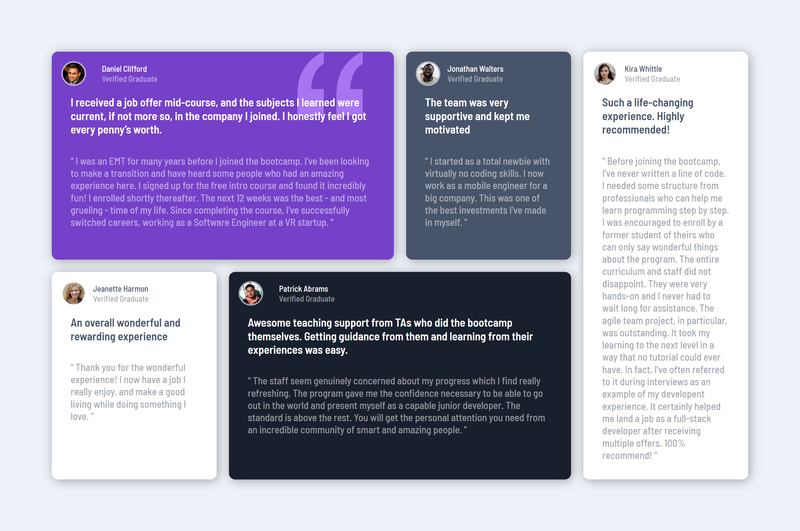
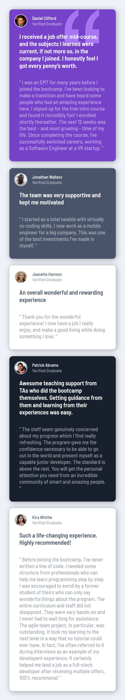

# Frontend Mentor - Advice generator app solution
This is a solution to the [Advice generator app challenge on Frontend Mentor](https://www.frontendmentor.io/challenges/advice-generator-app-QdUG-13db).

## Table of contents

- [Overview](#overview)
  - [The challenge](#the-challenge)
  - [Screenshot](#screenshot)
  - [Links](#links)
  - [Built with](#built-with)
  - [What I learned](#what-i-learned)
  - [Useful resources](#useful-resources)
- [Author](#author)

## Overview

This is a solution to the [Advice generator app challenge on Frontend Mentor](https://www.frontendmentor.io/challenges/advice-generator-app-QdUG-13db).

### The challenge

Users should be able to:

- View the optimal layout for the app depending on their device's screen size
- See hover states for all interactive elements on the page
- Generate a new piece of advice by clicking the dice icon

### Screenshot





### Links

- Solution URL: [Add solution URL here](https://your-solution-url.com)
- Live Site URL: [Add live site URL here](https://your-live-site-url.com)

### Built with

- Semantic HTML5 markup
- CSS custom properties
- Flexbox
- js
- json

### What I learned

I have learned how to daal with JSON and display it in the page 

```js
    //Get Advice
    let jasonReq=new XMLHttpRequest();
    jasonReq.open("GET","https://api.adviceslip.com/advice");
    jasonReq.send();
  console.log(jasonReq);
  jasonReq.onreadystatechange=function(){
    if(this.readyState===4&&this.status===200){
      
      document.querySelector(".advTxt").appendChild(document.createTextNode(`" ${JSON.parse(jasonReq.response).slip.advice}"`));
      document.querySelector(".id span").appendChild(document.createTextNode(JSON.parse(jasonReq.response).slip.id))
    }
  }
```
### Useful resources

- [Request And Response From Real API](https://www.youtube.com/watch?v=-RmWQYMGeIs&list=PLDoPjvoNmBAx3kiplQR_oeDqLDBUDYwVv&index=178) - This helped me with dealing with JSON . I really liked this video.

## Author

- Frontend Mentor - [@Mariam Ayman Kilany](https://www.frontendmentor.io/profile/mariamkilany)
